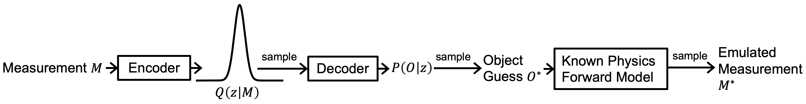

<br/>
<p align="center"></p>

----


The physics-informed variational autoencoder is a framework that uses self-supervised learning for reconstruction in sparse computational imaging. This repository `LED_PVAE` implements the physics-informed variational autoencoder for LED array microscopy, when the number of collected images is much less than the number of LEDs in the array.

# Overview
The figure below shows the overview of the end-to-end `LED_PVAE` pipeline.

<p align="center"></p>

The main algorithm comprising the `LED_PVAE` is inspired by the variational autoencoder. This repository allows creation of synthetic object datasets and generation of corresponding noisy intensity images. Object reconstruction from the intensity images can be performed with the physics-informed variational autoencoder or a standard gradient-based iterative algorithm. Options are included for using synthetic data or real experimental data collected on an LED array microscope. Code is included for visualization and comparison of results, and instructions are below for reproducing all the figures of the paper. An experimental dataset of frog blood smear images for use with this repository is available on [figshare](https://doi.org/10.6084/m9.figshare.21232088).

# Table of contents
1. [Installation](#Installation)
2. [Synthetic Foam Dataset](#Foam)
3. [Synthetic 3-Dimensional MNIST Dataset](#MNIST)
4. [Experimental Dataset](#Experimental)

   
# Installation <a name="Installation"></a>

First, navigate to the folder where you want the repository and clone the repository:
```
git clone https://github.com/vganapati/LED_PVAE.git
```

Create a `conda` environment:
```
cd LED_PVAE
conda env create -f environment.yml
conda activate LED
```

Once you're done with the above step, you need to use `pip install` to finish installing all the dependencies, using:
```
pip install -r requirements.txt
```


And you're all set!


## Synthetic Foam Dataset <a name="foam"></a>

Navigate to the `LED_PVAE` directory.

First, create the dataset of objects:
```
python SyntheticMNIST_multislice.py --save_path foam_v2_pac1 --td --tn_train 10000 --tn_test 0 --rad 3 --Nx 128 --Ny 128 --dti 5 --rmf 0.9 -f 0 --ns 1 --pac 1
```

Next, create the multiplexed illumination patterns and emulate the corresponding intensity images (i.e. measurements) for different noise levels (to get the matching illumination patterns for every noise level, do not run commands below in parallel, complete the first command before running the others):
```
python create_multiplexed.py --input_path dataset_foam_v2_pac1 --save_tag pnm1e4_dm01_p4 --pnm 1e4 --dm 0.1 -p 4
python create_multiplexed.py --input_path dataset_foam_v2_pac1 --save_tag pnm1e2_dm01_p4 --pnm 1e2 --dm 0.1 -p 4 --save_tag_alpha pnm1e4_dm01_p4
python create_multiplexed.py --input_path dataset_foam_v2_pac1 --save_tag pnm1e3_dm01_p4 --pnm 1e3 --dm 0.1 -p 4 --save_tag_alpha pnm1e4_dm01_p4
python create_multiplexed.py --input_path dataset_foam_v2_pac1 --save_tag pnm1e5_dm01_p4 --pnm 1e5 --dm 0.1 -p 4 --save_tag_alpha pnm1e4_dm01_p4
```

Next, do the same as above, except fixing all illumination patterns to be the **same**:
```
python create_multiplexed.py --input_path dataset_foam_v2_pac1 --save_tag pnm1e4_single_dm01_p4 --pnm 1e4 --dm 0.1 -p 4 --single
python create_multiplexed.py --input_path dataset_foam_v2_pac1 --save_tag pnm1e2_single_dm01_p4 --pnm 1e2 --dm 0.1 -p 4 --single --save_tag_alpha pnm1e4_single_dm01_p4
python create_multiplexed.py --input_path dataset_foam_v2_pac1 --save_tag pnm1e3_single_dm01_p4 --pnm 1e3 --dm 0.1 -p 4 --single --save_tag_alpha pnm1e4_single_dm01_p4
python create_multiplexed.py --input_path dataset_foam_v2_pac1 --save_tag pnm1e5_single_dm01_p4 --pnm 1e5 --dm 0.1 -p 4 --single --save_tag_alpha pnm1e4_single_dm01_p4
```

Run the following to train the P-VAE on the dataset with different illumination patterns for every object, sweeping through different dataset sizes, noise levels, and measurements per object:
```
./scripts/sweep.sh dataset_foam_v2_pac1 foam_pac1 false
```

Run the following to train the P-VAE on the dataset with the **same** illumination patterns for every object, sweeping through different dataset sizes, noise levels, and measurements per object:
```
./scripts/sweep.sh dataset_foam_v2_pac1 foam_pac1 true
```

Run the following to train the P-VAE on a training dataset of size 1 (object indices 0-9 of the complete dataset, using the illumination pattern from the different illuminations):
```
./scripts/sweep_single_example.sh dataset_foam_v2_pac1 foam_pac1 0 false
./scripts/sweep_single_example.sh dataset_foam_v2_pac1 foam_pac1 1 false
./scripts/sweep_single_example.sh dataset_foam_v2_pac1 foam_pac1 2 false
./scripts/sweep_single_example.sh dataset_foam_v2_pac1 foam_pac1 3 false
./scripts/sweep_single_example.sh dataset_foam_v2_pac1 foam_pac1 4 false
./scripts/sweep_single_example.sh dataset_foam_v2_pac1 foam_pac1 5 false
./scripts/sweep_single_example.sh dataset_foam_v2_pac1 foam_pac1 6 false
./scripts/sweep_single_example.sh dataset_foam_v2_pac1 foam_pac1 7 false
./scripts/sweep_single_example.sh dataset_foam_v2_pac1 foam_pac1 8 false
./scripts/sweep_single_example.sh dataset_foam_v2_pac1 foam_pac1 9 false
```

Run the following to train the P-VAE on a training dataset of size 1 (object indices 0-9 of the complete dataset, using the illumination pattern from the case where they are all the same):
```
./scripts/sweep_single_example.sh dataset_foam_v2_pac1 foam_pac1 0 true
./scripts/sweep_single_example.sh dataset_foam_v2_pac1 foam_pac1 1 true
./scripts/sweep_single_example.sh dataset_foam_v2_pac1 foam_pac1 2 true
./scripts/sweep_single_example.sh dataset_foam_v2_pac1 foam_pac1 3 true
./scripts/sweep_single_example.sh dataset_foam_v2_pac1 foam_pac1 4 true
./scripts/sweep_single_example.sh dataset_foam_v2_pac1 foam_pac1 5 true
./scripts/sweep_single_example.sh dataset_foam_v2_pac1 foam_pac1 6 true
./scripts/sweep_single_example.sh dataset_foam_v2_pac1 foam_pac1 7 true
./scripts/sweep_single_example.sh dataset_foam_v2_pac1 foam_pac1 8 true
./scripts/sweep_single_example.sh dataset_foam_v2_pac1 foam_pac1 9 true
```

Run the following for standard iterative optimization, using the illumination patterns from the case where they are all different:
```
./scripts/optimizer_sweep.sh dataset_foam_v2_pac1 10000 5 1e-3 false
```

Run the following for standard iterative optimization, using the illumination pattern from the case where they are all the same:
```
./scripts/optimizer_sweep.sh dataset_foam_v2_pac1 10000 5 1e-3 true
```

Analyze and visualize the results by creating LaTeX tables, using the following script and trying different inputs. It is recommended to run the following using `spyder`.
```
final_analyze_table.py
```

Visualize the dataset with the following script. It is recommended to run the following using `spyder`.
```
plotter_helper_all_lowres.py
```

## Synthetic 3D MNIST Dataset <a name="MNIST"></a>

First, create the dataset:
```
python SyntheticMNIST_multislice.py --save_path MNIST_multislice_v2 --td --tn_train 10000 --tn_test 0 --rad 3 --Nx 32 --Ny 32 --dti 0 --rmf 0.9 --ns 2 -f -5 
```

Next, create the multiplexed illumination patterns and emulate the corresponding intensity images (i.e. measurements) for different noise levels (to get the matching illumination patterns for every noise level, do not run commands below in parallel, complete the first command before running the others):
```
python create_multiplexed.py --input_path dataset_MNIST_multislice_v2 --save_tag pnm1e4_dm01_p4 --pnm 1e4 --dm 0.1 -p 4
python create_multiplexed.py --input_path dataset_MNIST_multislice_v2 --save_tag pnm1e2_dm01_p4 --pnm 1e2 --dm 0.1 -p 4 --save_tag_alpha pnm1e4_dm01_p4
python create_multiplexed.py --input_path dataset_MNIST_multislice_v2 --save_tag pnm1e3_dm01_p4 --pnm 1e3 --dm 0.1 -p 4 --save_tag_alpha pnm1e4_dm01_p4
python create_multiplexed.py --input_path dataset_MNIST_multislice_v2 --save_tag pnm1e5_dm01_p4 --pnm 1e5 --dm 0.1 -p 4 --save_tag_alpha pnm1e4_dm01_p4
```

Run the following to train the P-VAE on the dataset, sweeping through different dataset sizes, noise levels, and measurements per object:
```
./scripts/sweep.sh dataset_MNIST_multislice_v2 mnist false
```

Run the following to train the P-VAE on a training dataset of size 1 (object indices 0-9 of the complete dataset):
```
./scripts/sweep_single_example.sh dataset_MNIST_multislice_v2 mnist 0 false
./scripts/sweep_single_example.sh dataset_MNIST_multislice_v2 mnist 1 false
./scripts/sweep_single_example.sh dataset_MNIST_multislice_v2 mnist 2 false
./scripts/sweep_single_example.sh dataset_MNIST_multislice_v2 mnist 3 false
./scripts/sweep_single_example.sh dataset_MNIST_multislice_v2 mnist 4 false
./scripts/sweep_single_example.sh dataset_MNIST_multislice_v2 mnist 5 false
./scripts/sweep_single_example.sh dataset_MNIST_multislice_v2 mnist 6 false
./scripts/sweep_single_example.sh dataset_MNIST_multislice_v2 mnist 7 false
./scripts/sweep_single_example.sh dataset_MNIST_multislice_v2 mnist 8 false
./scripts/sweep_single_example.sh dataset_MNIST_multislice_v2 mnist 9 false
```

Run the following for standard iterative optimization, using the illumination patterns from the case where they are all different:
```
./scripts/optimizer_sweep.sh dataset_MNIST_multislice_v2 10000 5 1e-3 false
```

Analyze and visualize the results by creating LaTeX tables, using the following script and trying different inputs. It is recommended to run the following using `spyder`.
```
final_analyze_table.py
```

Visualize the dataset with the following script. It is recommended to run the following using `spyder`.
```
plotter_helper_all_lowres.py
```

## Experimental Dataset <a name="experimental"></a>

Download the experimental dataset as a `.zip` file from [figshare](https://doi.org/10.6084/m9.figshare.21232088.v1), uncompress and place into the `LED_PVAE` folder.

Run standard iterative optimization using the full stack of intensity images obtained by sequential, single LED illumination:
```
python merge_patches.py --save_tag_recons _single_LED_iterative  --alr 1e-3 -i 10000
python merge_patches_visualizer.py --iterative --save_tag_recons _single_LED_iterative
```

Run standard iterative optimization using a single intensity image obtained by multiplexed LED illumination:
```
python merge_patches.py --save_tag_recons _p1_LED_iterative --alr 1e-4 -i 10000 -p 1 --md _Dirichlet --use_mult
python merge_patches_visualizer.py --iterative --save_tag_recons _p1_LED_iterative --md _Dirichlet
```

Run the physics-informed variational autoencoder, using a single intensity image obtained by multiplexed LED illumination for an 87 object dataset:
```
python FPM_VAE_v3.py --input_path dataset_frog_blood_v3 --save_path frog_blood_pvae -i 100000 -p 1 --td 87 --nb 3 --nfm 5 --nfmm 1.2 --dp 0 --lr 1e-4 --norm 100 --se 4 --ks 4 --il 3 --pnm 26869.35 -b 4 --klm 1.0 --klaf 1 --normal --visualize --en 0 --save_tag_mult real_multiplexed --real_data --uf 1 --use_window --real_mult --xcrop 512 --ycrop 512 --si 20000 --md _Dirichlet --train --fff_reconstruct
```

Visualize the dataset with the following script. It is recommended to run the following using `spyder`.
```
data_figures.py
```

Visualize the results, comparing the standard iterative with the physics-informed variational autoencoder with the following script:
```
python compare_iterative.py --save_tag_recons _single_LED_iterative _p1_LED_iterative --save_path frog_blood_pvae --md _Dirichlet
```